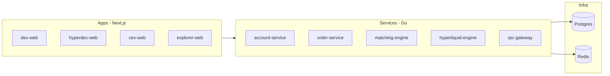

# Crypto Exchange Lab

A **monorepo learning lab** for exchange-style systems: simulated CEX, order-book DEX, perpetual futures (Hyperliquid-style), AMM DEX, RPC gateway, and block explorer.

> **Not a real exchange.** Simulated balances only. No deposits, withdrawals, or real-money trading. See [docs/DISCLAIMER.md](docs/DISCLAIMER.md).

**Live demo:** [docs/deploy.md](docs/deploy.md) — backend `./scripts/deploy-demo.sh` or Fly + Vercel · Grafana: `make monitoring-up`

## Architecture



## Repository layout

```text
apps/           # Next.js frontends
services/       # Go backends
contracts/      # Hardhat / Solidity
packages/       # go-common, ts-sdk
infra/          # Docker, migrations, Prometheus
docs/           # Disclaimer, roadmap, architecture
```

## Quick start

**Requirements:** Docker, Go 1.22+, Node 20+, pnpm 9+

```bash
# 0. Enable pnpm (once)
corepack enable && corepack prepare pnpm@9.15.0 --activate

# 1. Infrastructure
make up
make ps

# 2. Node dependencies
pnpm install

# 3. Go tests
make test-go

# 4. Contracts
pnpm contracts:test

# 5. Migrations (Postgres must be running)
make migrate

# 6. Backend
make run-account        # :8081
make run-matching       # :8083
make run-order          # :8082 CEX
make run-orderbook-dex  # :8084 DEX
make run-hyperliquid    # :8085 perps
make run-risk           # :8086
make run-liquidation    # :8087
make run-funding        # :8088

# 7. Frontends
cd apps/cex-web && pnpm dev      # http://localhost:3003
cd apps/dex-web && pnpm dev      # http://localhost:3001 (AMM Sepolia + OrderBook)
cd apps/hyperdex-web && pnpm dev # http://localhost:3002
cd apps/explorer-web && pnpm dev # http://localhost:3004

# Demo users: alice / bob (seeded balances)

# 8. Observability (optional)
make monitoring-up   # Prometheus :9090, Grafana :3000 (admin/lab)

# 9. Full backend in Docker (deploy demo)
chmod +x scripts/deploy-demo.sh && ./scripts/deploy-demo.sh
# Then deploy frontends on Vercel (see docs/deploy.md) or pnpm dev locally
```

See [docs/observability.md](docs/observability.md) and [docs/deploy.md](docs/deploy.md).

Copy environment variables:

```bash
cp .env.example .env
```

## Roadmap

| Phase | Focus |
|-------|--------|
| **0** | Monorepo scaffold ✅ |
| **1** | CEX ledger + matching ✅ |
| **2** | OrderBook DEX ✅ |
| **3** | Perpetual futures ✅ |
| **4** | AMM DEX (Sepolia) ✅ |
| **5** | RPC gateway + explorer ✅ |
| **6** | Deploy + observability ✅ |

Details: [docs/ROADMAP.md](docs/ROADMAP.md) · Markets: [docs/markets.md](docs/markets.md) · AMM: [docs/amm-dex.md](docs/amm-dex.md) · Explorer: [docs/explorer.md](docs/explorer.md) · Deploy: [docs/deploy.md](docs/deploy.md)

## Highlights (target)

- Double-entry ledger and balance freeze
- Price-time priority matching engine
- Margin, liquidation, and funding (simulated perps)
- Multi-chain RPC adapter pattern
- Uniswap V2–style AMM on testnet

## License

MIT — see [LICENSE](LICENSE).
